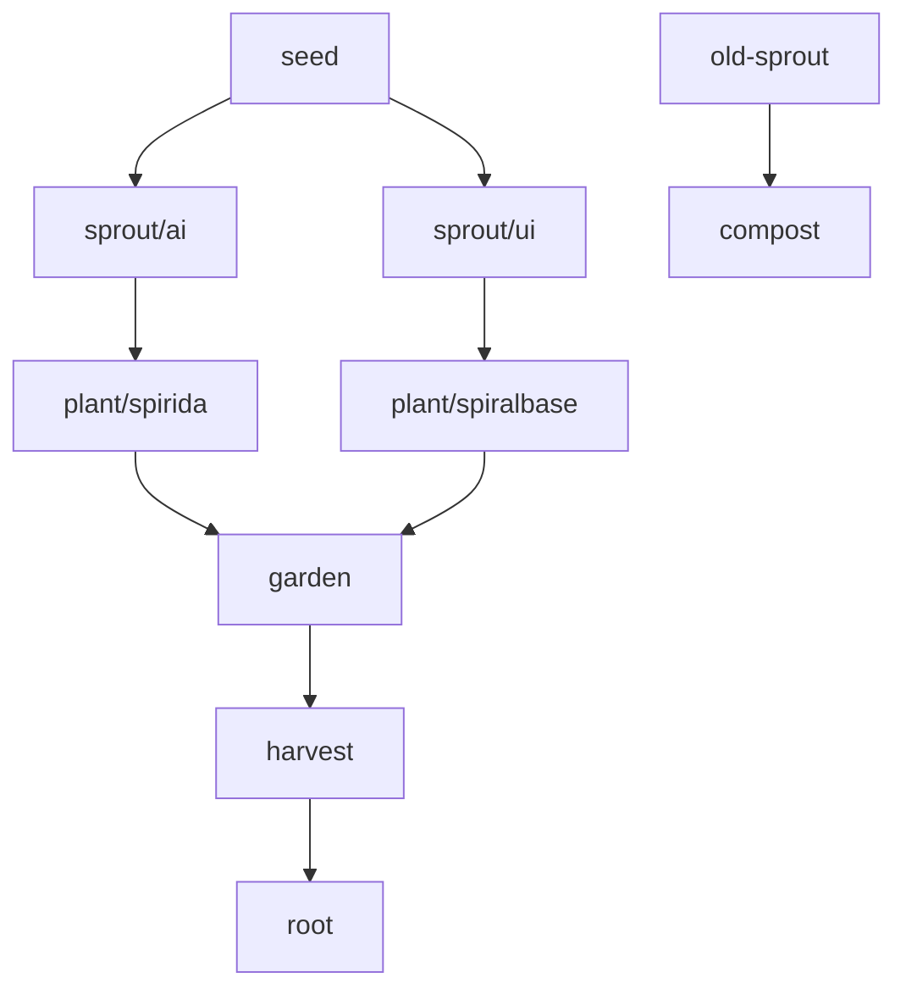

# 🌱 Mychainos Git Branching Guide: Spiral Garden Flow

This guide introduces a branching convention inspired by organic, spiral-based growth. Rather than relying on industrial hierarchies like `main`, `dev`, and `release`, this structure mirrors natural cycles and the Mychainos ethos.

---

## 🌿 Branch Table: Spiral Garden Flow vs Traditional

| Branch         | Purpose                            | Symbolism                 | Traditional Equivalent       |
|----------------|-------------------------------------|----------------------------|------------------------------|
| `seed`         | Initial ideas or raw experiments    | The seed of a future form | `feature/*`, `idea/*`        |
| `sprout/<name>`| Early explorations of a concept     | A sprouting thread        | `prototype`, `early-dev`     |
| `plant/<name>` | Actively growing branch             | A growing part of the whole| `dev`, `working`             |
| `garden`       | Collective testing, integration     | Where all things meet     | `test`, `staging`, `acc`     |
| `harvest`      | Polished and ready for release      | Reaping the outcome       | `release`, `pre-main`        |
| `root`         | Stable, shared version of system    | The system’s foundation   | `main`, `master`             |
| `compost`      | Archived or abandoned branches      | Recycling old energy      | `graveyard`, `archive`       |

---

## 🔄 Flow Example

---

## ✅ Recommendations

- Keep `root` as the single source of truth.
- Use semantic, descriptive names: `plant/spirida-ui`, `sprout/time-loop-indexing`, etc.
- Merge to `garden` regularly for system-wide integration.
- Document major shifts in `harvest` before merging into `root`.

---

## 🧠 Rationale
This model supports creativity, multiple simultaneous tracks, and reflective growth. It provides enough structure for collaboration while respecting the living, evolving nature of Mychainos.

---

## 📌 Tips
- Create GitHub labels or project boards to visually reflect this spiral flow.
- Automate CI/CD triggers based on `garden`, `harvest`, and `root`.
- Use `compost` as a safe place for abandoned but interesting branches.

---

Let it grow 🌀
